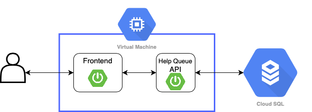
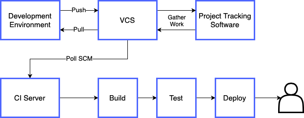

# Help Queue Application 

For this project, you are tasked with creating a Help Queue web application. 

The purpose of this application is to work as a virtual hands-up tool to alert trainers to who needs help in their class. 

Trainees can post help tickets to the queue, with oldest tickets at the top of the list. Trainers can then view the queue to see who needs help next. 

When a ticket has been solved, it is marked as "Done" by the user and added to a separate "Completed" list. The next-oldest ticket is moved to the top of the list. 

Here is a quick mockup of what the UI could look like to give you an idea: 

At its most basic functionality, the ticket should comprise of: 

- Title 
- Author 
- Description 
- Time created 

## Application Structure 

The application should be built as multiple distinct services. 

### Frontend Service 

Serves the UI for the web application. 

The UI is written in JS/HTML/CSS. 

### Backend Service 

The backend logic and database querying should be handled by a backend API service. 

The MVP requires you to build a single API service that will handle all the backend logic. 

This architecture should look like this: 

However, you should be striving to build your application with a microservice architecture, where each function of the application is handled by a separate service. 

As you add more functionality, you will naturally need to add more backend services.

### Database 

Data should be persisted in a managed AWS RDS database. You will have to create the table schema for this yourself. 

Below is the expected entity diagram for a Ticket in the help queue. 

Multiple features in this specification will require you to add more entities to your database and create relationships between them. 

### Features 

There are multiple stages of development for this application. Each stage increases in complexity. 
 
In addition to basic functionality, you are expected to implement at least 3 features by the end of this project. 

#### Basic Functionality 

Create basic functionality for the application, including full CRUD. 

Users will be able to: 
- Create new tickets and add them to the queue 
- View tickets in the current queue from oldest to newest 
- Delete existing tickets in the queue 
- Update existing tickets in the queue 

#### Solutions 

When a ticket is being marked as "Done", users should be able to add a solution to that ticket, allowing other users to see the solutions to a problem that has already been solved. 

#### Classrooms

Implement a help queue per classroom, such that learners can navigate to their classroom to see the help queue specific to their class. 

A class page should display the teachers and learners that make up that cohort. 

#### Assignment 

Users can assign trainees and trainers to a help ticket. The trainers/trainees they can assign should be dependent on the current cohort. 

#### Filtering 

Users can filter/arrange tickets based on attributes such as: 
- Author 
- Date Oldest -> Newest 
- Date Newest -> Oldest 
- Urgency 
- Title (alphabetically) 

#### Topics 

Tickets should be tagged with a topic. This should allow users to filter tickets based on a topic. 

#### Keyword Search 

Implement a search bar feature, so that users can filter tickets based on keywords. 

#### Urgency 

Tickets can be marked with different levels of urgency. 

#### Tagging 
Users can tag themselves to tickets to indicate they are having the same issue. 

Stretch Goals

Implement basic login functionality.

Users should only be able to: 
- Update tickets they have created 
- Delete tickets they have created 
- Mark tickets they have created as done 
- View the help queue for the cohort they are part of 

Implement two levels of privilege: trainer and trainee. 

Trainer privileges: 
- Only one who can close tickets 
- Can add answers to tickets 
- Able to update or delete any trainee's tickets 
- Can view any cohort's help queue 
Trainee privileges: 
- Cannot update or delete other trainee's tickets 
- Cannot mark a ticket as "Done" 
- Can only view their own cohort's help queue 

## CI Pipeline 

Code must be fully integrated into a Version Control System using the Feature-Branch model which will subsequently be built and tested through a Continuous Integration (CI) server, and finally deployed to a cloud-based virtual machine, making it accessible via the internet. 

To achieve this, you will make use of the following technologies:  
- Version Control System (VCS): Git  
- Cloud Provider: GCP  
- CI Server: Jenkins

Your CI system architecture should resemble the following:

